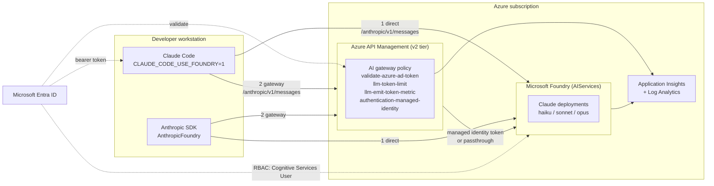

# Claude models in Microsoft Foundry — direct and AI gateway demo

An end-to-end, deployable demonstration of **Anthropic Claude models running in Microsoft Foundry**, consumed two ways:

1. **Direct** — Claude Code (and any Anthropic SDK client) calls the Foundry Anthropic endpoint.
2. **Via the AI gateway** — the same clients call **Azure API Management**, which fronts Foundry with token governance, per-caller quotas, telemetry and centralized identity.

Both paths support **Microsoft Entra ID authentication with no API keys at all**, and both also support **API key authentication** as a second, independently demonstrable credential scenario — four combinations in total. See [docs/05-entra-authentication.md](docs/05-entra-authentication.md) for the full matrix and the caveats.

|  | Direct to Foundry | Via the AI gateway |
|---|---|---|
| **Entra ID** | user's own token, RBAC-enforced | token validated at the edge, gateway calls Foundry with its managed identity |
| **API key** | Foundry account key | per-consumer APIM subscription key; the client never holds a Foundry secret |

Key auth needs `disableLocalAuth = false`, which tenant policy permits only on resources tagged `SecurityControl=Ignore` — applied by default via `allowLocalAuthExemption`. Entra remains the recommended credential; keys exist because a hardened tenant may block the consent that Claude *Desktop*'s app registration requires.



## What gets deployed

| Resource | Purpose |
| --- | --- |
| `Microsoft.CognitiveServices/accounts` (kind `AIServices`) | The Foundry account exposing `https://<name>.services.ai.azure.com/anthropic` |
| `accounts/projects` | Foundry project for portal-side experimentation |
| `accounts/deployments` × 1–3 | Claude Haiku / Sonnet / Opus, `GlobalStandard` |
| `Microsoft.ApiManagement/service` (BasicV2 by default) | The AI gateway. **A v2 tier is required** for Anthropic Messages API support |
| APIM API + policy + backend + named values | Anthropic Messages API surface with governance and pluggable auth |
| Log Analytics + Application Insights | Request tracing and per-caller token metrics |
| Role assignments | `Cognitive Services User` for you and for the gateway managed identity |

## Quick start

```powershell
# 0. Prerequisites: Azure CLI, Bicep, a subscription with the Claude Marketplace
#    offer available, and Owner or User Access Administrator on it.
az login

# 1. Set your organization details (required by Anthropic's model attestation).
#    Edit infra/main.bicepparam -> claudeOrganizationName, claudeCountryCode, claudeIndustry.

# 2. Deploy. API Management provisioning takes 15-45 minutes on first create.
./scripts/deploy.ps1 -Location eastus2 -GrantSelfAccess

# 3a. Point Claude Code at Foundry directly, using Entra (no keys).
. ./scripts/Set-ClaudeCodeEnv.ps1 -Mode Direct -Auth Entra
./scripts/Test-ClaudeEndpoint.ps1 -Mode Direct -Auth Entra
claude          # then /status -> API provider: Microsoft Foundry

# 3b. Now route the identical client through the AI gateway.
. ./scripts/Set-ClaudeCodeEnv.ps1 -Mode Gateway -Auth Entra
./scripts/Test-ClaudeEndpoint.ps1 -Mode Gateway -Auth Entra
claude

# 4. Claude Desktop (the standalone app) is a separate client with its own
#    settings. This creates the Entra app registration, writes .env, and
#    applies it. Quit Claude Desktop completely first - it reads config
#    only at launch.
./scripts/New-ClaudeConfig.ps1 -Mode Direct -CreateAppRegistration -Apply

# 4b. If your tenant blocks user consent ("Need admin approval"), use the
#     key credential instead. No app registration, no consent, no admin.
./scripts/New-ClaudeConfig.ps1 -Mode Direct -CredentialKind static -Apply
```

On macOS or Linux use `source ./scripts/set-claude-code-env.sh direct entra` instead.

## Documentation

| Doc | Contents |
| --- | --- |
| [01 — Architecture](docs/01-architecture.md) | Components, request flows, design decisions and why each one was made |
| [02 — Deploy](docs/02-deploy.md) | Prerequisites, parameters, deployment, teardown |
| [03 — Claude Code direct](docs/03-claude-code-direct.md) | Every environment variable, model pinning, desktop app and CLI |
| [04 — Claude Code via the AI gateway](docs/04-claude-code-gateway.md) | Gateway configuration, policy walkthrough, governance features |
| [05 — Entra authentication](docs/05-entra-authentication.md) | **The auth matrix**: does Entra work for both paths, and how |
| [06 — Demo script](docs/06-demo-script.md) | A 20-minute run-of-show with talk track and expected output |
| [07 — Troubleshooting](docs/07-troubleshooting.md) | Error-by-error diagnosis for both paths |

## Repository layout

```
infra/
  main.bicep                     subscription-scoped orchestrator
  main.bicepparam                the knobs you actually change
  modules/
    foundry.bicep                Foundry account, project, Claude deployments, RBAC
    apim.bicep                   API Management v2 + Application Insights logger
    apim-anthropic-api.bicep     Anthropic API, backend, named values, policy, product
    monitoring.bicep             Log Analytics + Application Insights
  policies/
    anthropic-api.xml            the AI gateway policy (the heart of the demo)
scripts/
  deploy.ps1                     deploy and capture outputs
  Set-ClaudeCodeEnv.ps1          configure Claude Code (PowerShell)
  set-claude-code-env.sh         configure Claude Code (bash/zsh)
  Test-ClaudeEndpoint.ps1        smoke test either path, either credential
  Set-GatewayAuthMode.ps1        switch auth topology live, without redeploying
  New-FoundryAppRegistration.ps1 create the Entra public-client app (idempotent)
  New-ClaudeConfig.ps1           write .env for either scenario, optionally apply
  Set-ClaudeDesktopConfig.ps1    apply .env to Claude Desktop; export reg/plist/JSON
.env.example                     annotated reference for every client setting
samples/
  python/hello_claude.py         Anthropic SDK, all four path/credential combos
  rest/anthropic.http            raw HTTP requests for VS Code REST Client
docs/                            see the table above
```

## Key facts worth knowing before you demo

- The `model` field in a request is the **Foundry deployment name**, not the Anthropic model ID. This is the single most common demo failure.
- Claude Code has **no interactive setup wizard** for Foundry (unlike Bedrock and Vertex). Configuration is environment variables only.
- **Always pin models.** Without `ANTHROPIC_DEFAULT_SONNET_MODEL` and friends, aliases resolve to Claude Code's built-in Foundry defaults, which may not exist in your account. There is no startup validation, so the failure appears mid-conversation.
- The Anthropic Messages API schema in the API Management AI gateway requires a **v2 tier** (`BasicV2`, `StandardV2`, `PremiumV2`).
- Claude on Foundry bills in **Claude Consumption Units** through Azure Marketplace, and is unavailable on CSP, credit-only and sponsored subscriptions. Entra External and most trial subscriptions carry a Marketplace purchase policy that blocks the offer outright.
- **Claude Desktop is not Claude Code.** It ignores `ANTHROPIC_*` environment variables and reads its own settings, and it has two distinct providers — `foundry` and `gateway` — with different key sets.
- Claude Desktop's gateway sign-in must request `https://cognitiveservices.azure.com/.default`, not `https://ai.azure.com`: the latter has no service principal a custom app registration can reference. The gateway accepts both audiences so one deployment serves both clients.
- Claude Desktop reads its configuration **once, at launch**. Quit it fully, including the tray icon.
- Tenant policy forces `disableLocalAuth = true` on Cognitive Services accounts, which kills every key-based path. The `SecurityControl=Ignore` tag exempts the resource; `allowLocalAuthExemption = true` applies it. ARM reports `Succeeded` either way, so verify the live resource, not the deployment.
- The Foundry **Anthropic** surface expects `x-api-key`. `api-key` returns `401` with a message about an invalid subscription key, even though the key is fine. The Azure OpenAI surface of the same account is the other way round.
- If Claude Desktop's Entra sign-in stops at **"Need admin approval"**, the tenant has disabled self-service consent. Use `-CredentialKind static`, or have an admin grant consent once.

## Deployment status � verified end to end

Both scenarios were deployed to Azure and exercised with live inference, most recently
on 2026-08-21 (`eastus2`, API Management `BasicV2`, Foundry with `claude-haiku-4-5` v2 and
`claude-sonnet-4-6` v1).

| Check | Result |
|---|---|
| Scenario 1 � direct to Foundry, Entra token | `200` |
| Scenario 1 � direct to Foundry, API key | `200` (after the `SecurityControl=Ignore` exemption) |
| Scenario 2 � via gateway, subscription key | `200` |
| Scenario 2 � via gateway, Entra token | `200` |
| Scenario 2 � via gateway, no credential | `401` |
| Backend auth `managedIdentity` | `200` |
| Backend auth `passthrough` with caller token | `200` |
| SSE streaming through the gateway | full event sequence |
| Gateway token budget (`llm-token-limit`) | `429` + `Retry-After` |
| Both models, both paths | `200` |
| Gateway accepts both Entra audiences (`ai.azure.com`, `cognitiveservices.azure.com`) | named value `entra-audience-alt` present |
| Entra public-client app registration for Claude Desktop | created, idempotent on re-run |
| `.env` generation and apply, Direct and Gateway | profile written, matches the app's own schema |
| Foundry `disableLocalAuth` after tagging `SecurityControl=Ignore` | flipped `true` -> `false`, keys retrievable |
| Anthropic endpoint key header | `x-api-key` `200`; `api-key` and `Ocp-Apim-Subscription-Key` `401` |

Four findings from that exercise are worth reading before you present this:

1. **Claude model versions are not uniform.** `claude-sonnet-4-6` publishes version `1`
   only, while `claude-haiku-4-5` and `claude-opus-4-8` publish version `2`. That is why
   the template exposes `haikuModelVersion`, `sonnetModelVersion` and `opusModelVersion`
   separately rather than one global version.

2. **Internal, sandbox and credit-only subscriptions cannot deploy Claude at all.** It is
   a Marketplace offer. The failure is late and misleading � the Foundry account and
   project both report `Succeeded` and only the model deployment fails. Probe with one
   model at capacity 1 before committing to a 30-minute run.

3. **A tenant Azure Policy can force `disableLocalAuth = true`,** overriding the
   template's `disableFoundryLocalAuth = false` after ARM reports success. API keys then
   cannot be issued at all. This turned out to be a good thing to demo: the entire flow
   above ran with **no Foundry key in existence**, which is the strongest possible version
   of the Entra story.

4. **API Management checks the subscription key before the inbound policy runs.** Any
   client-auth mode that permits Entra must therefore deploy the API with
   `subscriptionRequired = false` and enforce credentials in policy instead, or
   Entra-only callers are rejected before `validate-azure-ad-token` is ever reached.

Full evidence, request/response transcripts and the exact error strings are in
[docs/05-entra-authentication.md](docs/05-entra-authentication.md),
[docs/04-claude-code-gateway.md](docs/04-claude-code-gateway.md) and
[docs/07-troubleshooting.md](docs/07-troubleshooting.md).
